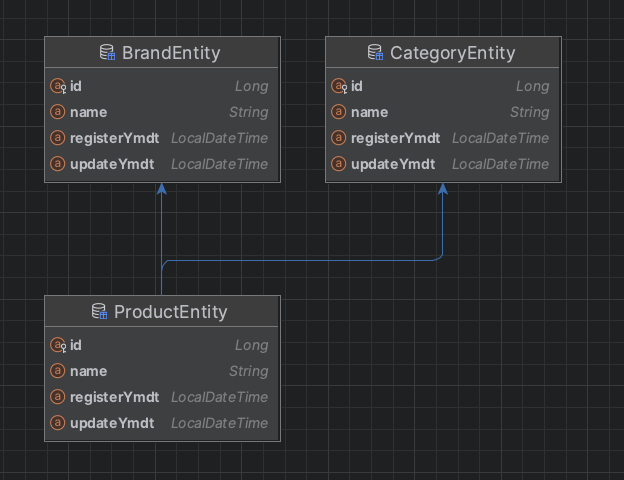

# MUSINSA 무신사 Java(kotlin) Backend

## ○ 개발환경
- **Backend**: Java, Spring Boot, Spring Data JPA, JOOQ
- **Database**: H2 Database(Embedded Mode)
- **Build Tool**: Gradle
- **Testing**: JUnit, Postman
- **Mapping**: MapStruct, Lombok


## ○ 코드 빌드, 테스트, 실행 방법
### 1. 프로젝트 클론
먼저 GitHub 또는 원격 저장소에서 프로젝트를 로컬로 클론합니다

### 2. 코드 빌드
```
// 테스트 제외하고 빌드
./gradlew build -x test
```

### 3. 실행 방법
Run 'MusinsaProjectApplication'

### 3. 테스트
```
//어플리케이션 실행을 종료하고 실행해야함(H2 Database 충돌때문)
/* FAILED 뜨는 테스트는 PATCH, DELETE API 테스트 => id(PK) 값이 맞지 않아서 발생하는 이슈
  BrandControllerTest, ProductControllerTest 통합테스트에서 존재하는 id값 기입 필요 */

./gradlew test 
```

## ○ 접속정보
- 프론트 페이지 : http://localhost:8080/index.html
- H2 Database : http://localhost:8080/h2-console/login.jsp
- Postman API 목록 및 명세 : https://www.postman.com/planetary-water-518607/workspace/musinsa/collection/21657406-a009b407-efad-4068-b9d6-f900e14ca680?action=share&creator=21657406


## ○ 구현범위에 대한 설명
### 1. Brand API
- **브랜드 CRUD** : 생성, 조회, 수정, 삭제 기능 구현.
    - `BrandController`, `BrandUseCase`, `BrandService`, `BrandRepository`로 구성된 계층 구조 사용.
    - 브랜드 데이터는 `BrandEntity`로 DB에 저장되고, `DTO`(Brand)를 통해 전달.

- **특징**:
    - 다수의 브랜드를 한번에 추가하는 기능.
    - 브랜드 삭제 시 관련 상품들도 함께 삭제되도록 구현.

### 2. Product API
- **상품 CRUD** : 생성, 조회, 수정, 삭제 기능 구현.
  - `ProductController`, `ProductUseCase`, `ProductService`, `ProductRepository`로 구성된 계층 구조 사용.
  - 브랜드 데이터는 `ProductEntity`로 DB에 저장되고, `DTO`(Product)를 통해 전달.
  - 상품 추가 시 브랜드 ID 및 카테고리 ID를 필수로 입력해야 함. 브랜드 ID와 카테고리 ID에는 외래키가 지정되어 있기 때문

- **예외 처리**:
    - 브랜드 ID 또는 카테고리 ID가 없을 경우 `DataIntegrityViolationException` 처리.
    - 특정 필드만 수정할 수 있는 부분 업데이트(Patch) 기능.

### 3. 가격 조회 API
- JPA 및 JOOQ를 사용하여 가격 및 상품 정보 추출

- 확장 기능:
    - 동일 최저가 및 최고가가 존재할 때, 비즈니스 로직의 다양성을 고려하여 다양하게 구성함
      방법1) 특정 기준을 토대로 하나의 정보만 가지고 옴
          (ex: 브랜드 이름 내림차순)
      방법2) 동일 최저가 및 최고가 상품 전부를 가지고 옴
    - 한국어 컬럼명 반환을 위한 커스터마이징.

### 4. 데이터베이스
- H2 데이터베이스 사용.
    - 테이블명: `BRAND_ENTITY`, `PRODUCT_ENTITY`, `CATEGORY_ENTITY`.
  

### 5. 테스트 코드
- 브랜드 및 상품 생성, 수정, 삭제 기능 테스트
    - `BrandController`, `ProductController` 통합테스트
    - `ProductRepositoryTest`, `ProductServiceTest` 단위테스트
    
